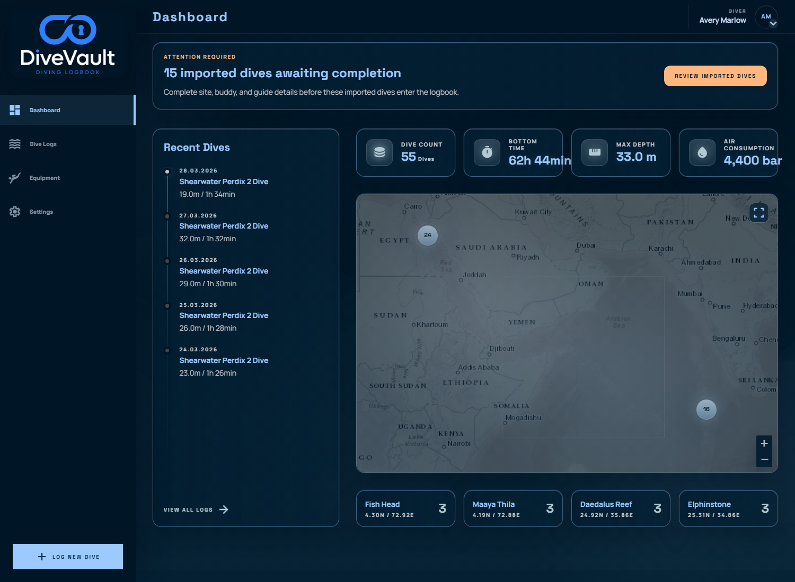
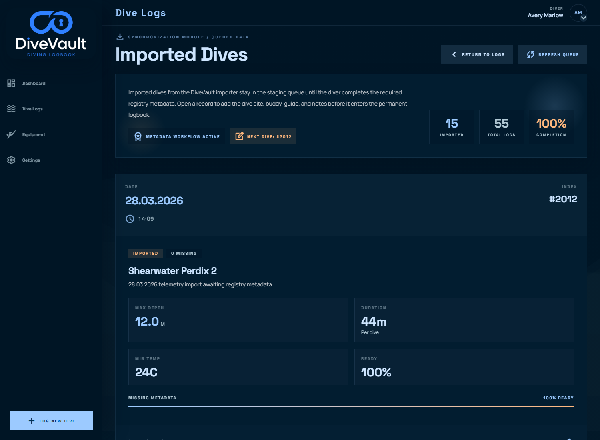
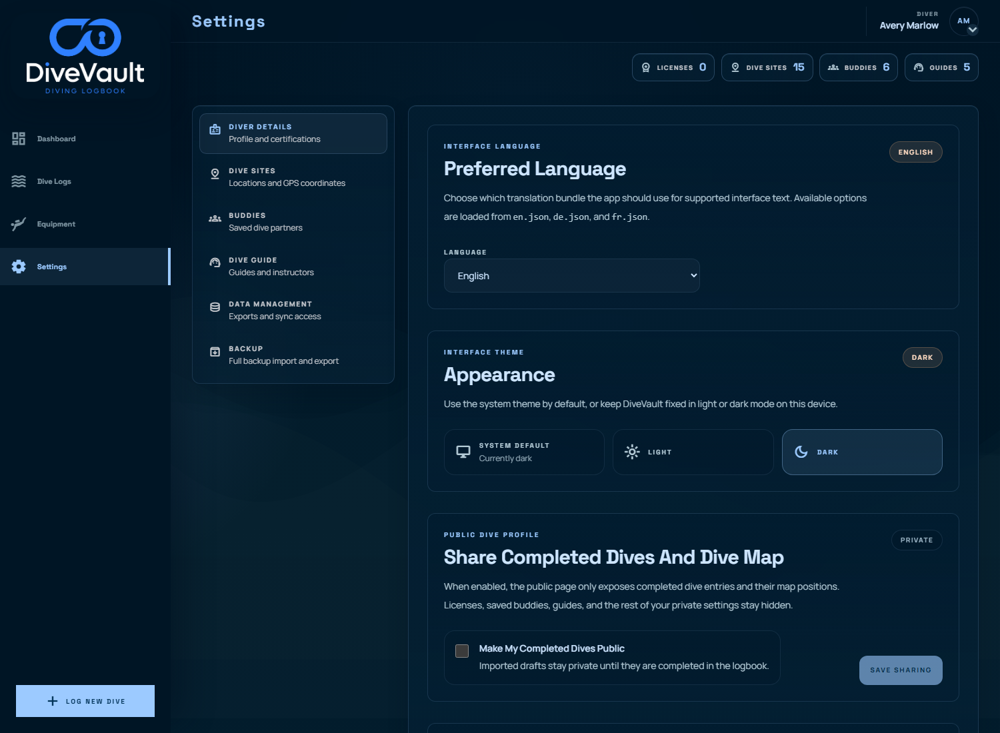

<p align="center">
  
</p>

<h1 align="center">DiveVault</h1>

<p align="center">
  Self-hosted dive logbook, import queue, and review UI for dive computer telemetry.
</p>

<p align="center">
  
  
  
  
  
</p>

<p align="center">
  <a href="#quick-start">Quick Start</a> ·
  <a href="#docker">Docker</a> ·
  <a href="#screenshots">Screenshots</a> ·
  <a href="#what-divevault-does">What It Does</a> ·
  <a href="#features">Features</a> ·
  <a href="#testing">Testing</a> ·
  <a href="#contributing">Contributing</a>
</p>

---

DiveVault is a dive log backend and web UI built around a staged workflow:

1. A companion desktop importer reads telemetry from a dive computer and uploads dives into DiveVault.
2. Imported dives land in a review queue.
3. The diver completes required metadata such as site, buddy, guide, and notes.
4. Completed dives move into the permanent logbook and analytics views.

The result is a system that keeps raw telemetry, review state, and curated logbook records in one place.

## Quick Start

### Requirements

- Python 3.12+
- Node.js 24+
- PostgreSQL

### Backend

```powershell
python -m venv .venv
.\.venv\Scripts\Activate.ps1
pip install -r backend/requirements-dev.txt
Copy-Item .env.example .env
Set-Location backend
python -m divevault.app
```

### Frontend

```powershell
Set-Location frontend
npm ci
npm run dev
```

Default local URLs:

- Frontend: `http://localhost:5173`
- Backend: `http://localhost:8000`

## Docker

Run the full local stack with:

```powershell
docker compose -f examples/docker/docker-compose.yml up --build
```

This starts:

- PostgreSQL on `localhost:5432`
- A one-shot migration service
- DiveVault backend on `localhost:8000`

For multi-pod deployments, run migrations as a separate job and set `STARTUP_MIGRATIONS=disabled` on backend pods.

## Screenshots

### Dashboard



### Imports And Settings

<table>
  <tr>
    <td width="50%">
      
    </td>
    <td width="50%">
      
    </td>
  </tr>
</table>

Screenshots above were generated from the local mocked development environment so the README stays reproducible.

## What DiveVault Does

- Stores imported dive telemetry and diver-completed logbook metadata in PostgreSQL
- Separates imported drafts from committed dives so incomplete records do not pollute the main logbook
- Tracks device sync state for importer workflows
- Supports browser approval for desktop sync requests
- Serves a Vue frontend for dashboarding, imports, log review, settings, and public profile views
- Supports Docker-first local and deployment workflows

## Features

- Import queue for incomplete dives waiting on metadata
- Dive logbook with detail views and editing flows
- Manual dive entry for dives without computer uploads
- Dive map and dashboard stats
- Saved dive sites, buddies, guides, and certification records
- Public profile / public dive log sharing
- Backup and restore flows
- Backend schema migration entrypoint for multi-container or Kubernetes deployments
- UI localization support with English, German, and French bundles

## Workflow Overview

### Import Workflow

- Desktop importer reads the dive computer and uploads payloads
- DiveVault stores the raw and parsed dive data
- Imported dives appear in the queue until required logbook fields are completed
- Once completed, the dive is marked as committed and appears throughout the rest of the app

### Backend Responsibilities

- Authenticated dive ingestion
- PostgreSQL persistence
- Device sync checkpoint storage
- Schema initialization and migrations
- Public profile and backup APIs

### Frontend Responsibilities

- Dashboard and map visualization
- Import queue and logbook editing
- Manual dive entry
- Profile, data management, and backup settings

## Testing

### Backend

```powershell
.\.venv\Scripts\python.exe -m pytest -q backend/tests
```

### Frontend

```powershell
Set-Location frontend
npm test
```

## Environment

Core variables from [`.env.example`](./.env.example):

- `DATABASE_URL`
- `AUTH_JWT_SECRET`
- `AUTH_JWT_ISSUER`
- `AUTH_JWT_AUDIENCE`
- `AUTH_TOKEN_TTL_SECONDS`
- `CLI_AUTH_REQUEST_TTL`
- `CLI_AUTH_TOKEN_TTL`
- `STARTUP_MIGRATIONS`
- `BACKEND_URL`
- `BACKEND_AUTH_TOKEN`

Optional service variables:

- `NOMINATIM_BASE_URL`
- `NOMINATIM_USER_AGENT`
- `NOMINATIM_EMAIL`
- `TRANSLATION_BASE_URL`
- `TRANSLATION_USER_AGENT`

Rate-limiting variables:

- `RATE_LIMIT_WINDOW_SECONDS`
- `RATE_LIMIT_CLI_REQUEST_PER_WINDOW`
- `RATE_LIMIT_CLI_APPROVE_PER_WINDOW`
- `RATE_LIMIT_BACKUP_IMPORT_PER_WINDOW`
- `RATE_LIMIT_DIVE_UPLOAD_PER_WINDOW`

## Contributing

If you want to work on DiveVault itself:

- Start with the run-it-yourself steps above so you can use the app end to end before changing code.
- Run backend and frontend tests before opening changes.
- Regenerate README screenshots with `frontend/scripts/capture-readme-screenshots.mjs` when UI changes affect the screenshots.

## Related Upstream

The companion importer side of this system is a natural place to use `libdivecomputer`.

- Project site: <https://libdivecomputer.org/>
- Source repository: <https://github.com/libdivecomputer/libdivecomputer>
