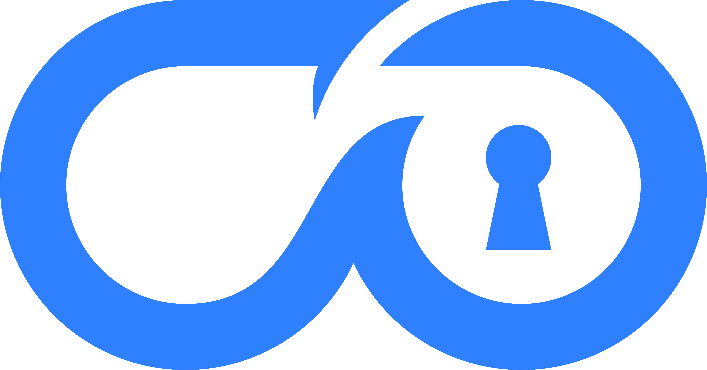

<div align="center">
  
  <h1>DiveVault</h1>
  <p><strong>Private dive log + importer workflow + web dashboard for recreational and technical divers.</strong></p>

  <p>
    <a href="#features">Features</a> •
    <a href="#screenshots">Screenshots</a> •
    <a href="#architecture">Architecture</a> •
    <a href="#local-development">Local Development</a> •
    <a href="#docker">Docker</a>
  </p>
</div>

> ⚠️ This project is heavily developed with AI. Use at your own risk.

DiveVault is a full-stack dive log platform with a **Python backend** and a **Vue frontend**. It is designed around a two-stage flow:

1. A desktop importer uploads parsed dives and telemetry.
2. DiveVault stages those records until required logbook metadata is completed.

---

## Features

- 🔐 **Authenticated dive ingestion** with per-user data isolation.
- 🗃️ **PostgreSQL-backed storage** for dives, profile metadata, and device sync checkpoints.
- 🧾 **Imported vs committed workflow** to keep logs complete before finalizing.
- 🌍 **Geocode search** for dive sites via Nominatim (`/api/geocode/search`).
- 🌐 **Translation service** for dive notes (LibreTranslate-compatible backend endpoint at `/api/translation/translate` + UI action in manual entry notes).
- 🧩 **Lightweight i18n layer** in `frontend/src/i18n/` with one file per language for easy extension.
- 📤 **Backup/export support** (JSON + PDF exports).
- 🐳 **Docker-first deployment** with migration support.

---

## Screenshots

The repository now includes a dedicated screenshots section for application visuals. In this execution environment, browser binaries could not be downloaded (Playwright CDN returned HTTP 403), so fresh captures could not be generated automatically.

If you run locally, use Playwright to capture and place images under `docs/screenshots/`, then update this section:

```bash
cd frontend
npm ci
npx playwright install
npx playwright test
```

Suggested files for this section:

- `docs/screenshots/dashboard.png`
- `docs/screenshots/import-queue.png`
- `docs/screenshots/manual-entry.png`

---

## Architecture

### Backend (Python)

- Entry point: `backend/divevault/app.py`
- HTTP runtime: `http.server` with threaded handler
- Storage: PostgreSQL via `psycopg`
- Auth: Clerk session tokens and API key support
- Translation provider: LibreTranslate-compatible API

### Frontend (Vue 3 + Vite)

- App root: `frontend/src/app.js`
- Componentized dashboard, logs, imports, settings, manual entry
- Served from `frontend/dist` in production
- Key-based i18n helper (`frontend/src/i18n/index.js`) with language-specific files

### Internationalization (i18n)

To add a new UI locale, add a new file in `frontend/src/i18n/` and register it in `frontend/src/i18n/index.js`.

Example shape:

```js
// frontend/src/i18n/it.js
export default {
  "manualDive.notes.translateCta": "Traduci le note in inglese",
  ...
}
```

The app auto-selects language from `navigator.language` and falls back to English.

### Persistence

- `dives` table: telemetry, samples, import metadata, logbook data
- `device_state` table: importer sync checkpoints
- Schema lifecycle: `divevault.postgres_store.init_db()` + migration script

---

## Repository Layout

- `backend/divevault/app.py` — API server, auth, geocode + translation integration
- `backend/divevault/postgres_store.py` — schema + PostgreSQL access helpers
- `backend/tests` — backend unit and endpoint tests
- `frontend` — Vue app, styling, and Playwright tests
- `backend/migrations/migrate_postgres_schema.py` — migration entrypoint
- `examples/docker/docker-compose.yml` — local stack orchestration

---

## Local Development

### Prerequisites

- Python 3.12+
- Node.js 24+
- PostgreSQL

### Backend

```powershell
python -m venv .venv
.\.venv\Scripts\Activate.ps1
pip install -r backend/requirements-dev.txt
Copy-Item .env.example .env
Set-Location backend
python -m divevault.app
```

### Frontend

```powershell
Set-Location frontend
npm ci
npm run dev
```

Default local URLs:

- Frontend: `http://localhost:5173`
- Backend: `http://localhost:8000`

---

## Docker

```powershell
docker compose -f examples/docker/docker-compose.yml up --build
```

Services started:

- PostgreSQL (`localhost:5432`)
- Backend (`localhost:8000`)
- One-shot migration job before backend starts

For Kubernetes/multi-pod setups, run migrations as a separate Job and set `STARTUP_MIGRATIONS=disabled` on backend pods.

---

## Environment Variables

Core runtime variables:

- `DATABASE_URL`
- `VITE_CLERK_PUBLISHABLE_KEY`
- `CLERK_SECRET_KEY`
- `CLERK_FRONTEND_API_URL`
- `CLERK_JWT_KEY` or `CLERK_JWKS_URL`
- `CLERK_AUTHORIZED_PARTIES`
- `CLI_AUTH_REQUEST_TTL`, `CLI_AUTH_TOKEN_TTL`
- `MAX_JSON_BODY_BYTES`
- `MAX_BACKUP_IMPORT_BYTES`
- `MAX_LIST_LIMIT`
- `STARTUP_MIGRATIONS`

Geocode and translation services:

- `NOMINATIM_BASE_URL`
- `NOMINATIM_USER_AGENT`
- `NOMINATIM_EMAIL`
- `TRANSLATION_BASE_URL`
- `TRANSLATION_USER_AGENT`

Rate limiting:

- `RATE_LIMIT_WINDOW_SECONDS`
- `RATE_LIMIT_CLI_REQUEST_PER_WINDOW`
- `RATE_LIMIT_CLI_APPROVE_PER_WINDOW`
- `RATE_LIMIT_BACKUP_IMPORT_PER_WINDOW`
- `RATE_LIMIT_DIVE_UPLOAD_PER_WINDOW`

---

## Testing

### Backend

```powershell
.\.venv\Scripts\python.exe -m pytest -q backend/tests
```

### Frontend

```powershell
cd frontend
npm test
```

---

## Companion Importer and libdivecomputer

DiveVault is the server/browser side of a larger system. The importer side can use `libdivecomputer` to communicate with supported devices.

- <https://libdivecomputer.org/>
- <https://github.com/libdivecomputer/libdivecomputer>
