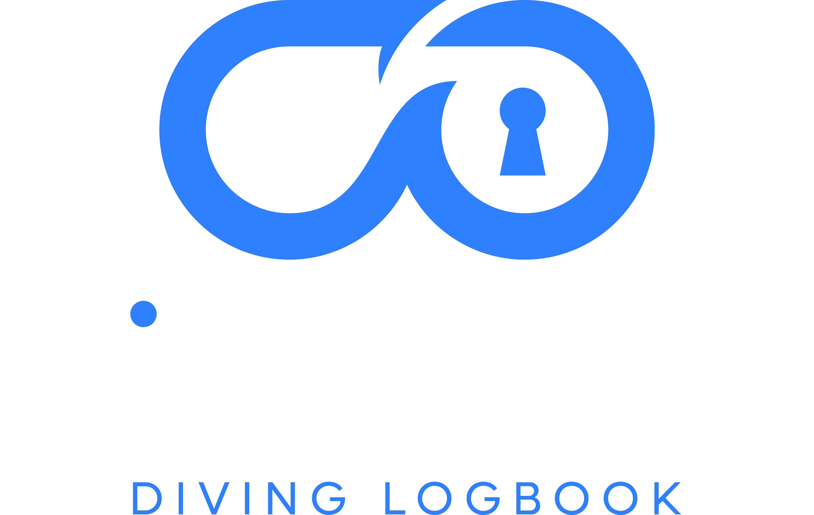
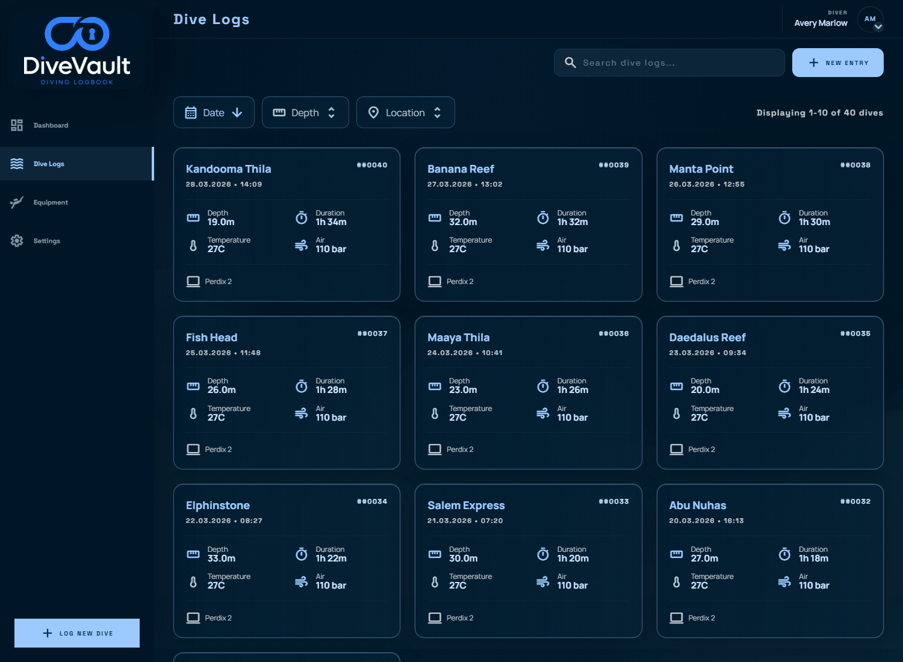
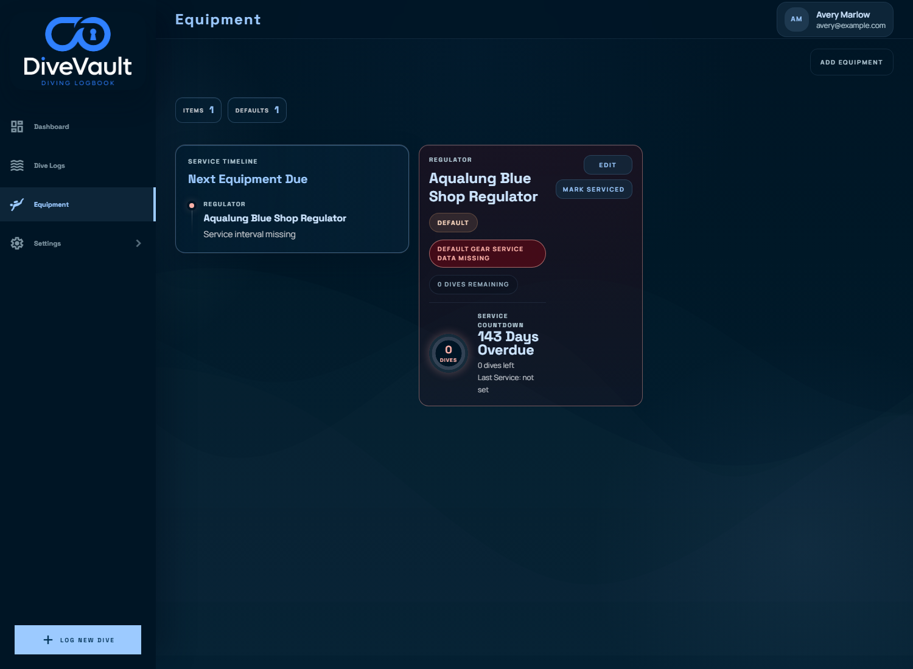

<p align="center">
  
</p>

<p align="center">
  <a href="https://demo.divevault.dev">Try the demo</a>
  |
  <a href="#quick-start">Quick Start</a>
  |
  <a href="#screenshots">Screenshots</a>
  |
  <a href="#features">Features</a>
  |
  <a href="./docs/MIGRATION.md">Migration Guide</a>
  |
  <a href="./docs/DEVELOPMENT.md">Developer Docs</a>
</p>

DiveVault is a self-hosted dive logbook for importing dive computer telemetry, reviewing new dives, and building a searchable logbook with sites, buddies, gear, maps, and public profile sharing.

The app is built around a simple flow:

1. Import dives from a supported dive computer.
2. Review imported drafts before they enter the logbook.
3. Add site, buddy, guide, equipment, and notes.
4. Browse your dive history, maps, statistics, and equipment records.

## Quick Start

The fastest way to run DiveVault is with Docker Compose:

```powershell
docker compose -f examples/docker/docker-compose.yml up
```

This starts PostgreSQL, runs the database migration job, and serves DiveVault at:

```text
http://localhost:8000
```

For production use, review `.env.example` and configure secrets, public URLs, authentication settings, database credentials, and backup storage before exposing the service.

## Kubernetes

Raw Kubernetes manifests are available in `examples/kubernetes/divevault.yaml`:

```powershell
kubectl apply -f examples/kubernetes/divevault.yaml
kubectl wait --for=condition=complete job/divevault-db-migrate --timeout=180s
kubectl rollout status deployment/divevault-backend
```

Forward the backend service locally:

```powershell
kubectl port-forward service/divevault-backend 8000:8000
```

A Helm chart is maintained separately at:

```text
https://github.com/jLemmings/helm-charts/tree/master/charts/divevault
```

Install it with:

```powershell
git clone https://github.com/jLemmings/helm-charts.git
helm upgrade --install divevault ./helm-charts/charts/divevault -f your-values.yaml
```

Before deploying, review image tags, database settings, ingress, secrets, and whether startup migrations should be enabled for your setup.

## Screenshots

<p align="center">
  
</p>

| Logbook | Import Queue |
| --- | --- |
|  |  |

| Equipment | Settings |
| --- | --- |
|  |  |

## Features

- Import queue for reviewing dive computer data before it becomes part of the logbook.
- Detailed dive pages with telemetry, location maps, site details, buddies, guides, equipment, and notes.
- Manual dive entry when no computer import is available.
- Dashboard with recent activity, dive statistics, and a world imagery map.
- Saved dive sites, buddies, guides, certifications, and equipment.
- Public profile sharing for selected dives.
- Backup and restore tools for self-hosted instances.
- English, German, and French interface localization.

## Import Workflow

DiveVault keeps raw imports separate from finished logbook entries. Imported dives arrive in a review queue where they can be enriched with missing metadata, corrected, or discarded. Once approved, the dive moves into the main logbook.

The companion importer handles device reads and upload requests. The web app also imports spreadsheet CSV files and Subsurface XML/SSRF exports from Settings -> Data Management. See the [migration and import guide](./docs/MIGRATION.md) for CSV columns, Subsurface export steps, limits, and review workflow details.

## Developer Docs

Development setup, backend and frontend commands, testing, migrations, architecture notes, and release details live in [docs/DEVELOPMENT.md](./docs/DEVELOPMENT.md).
